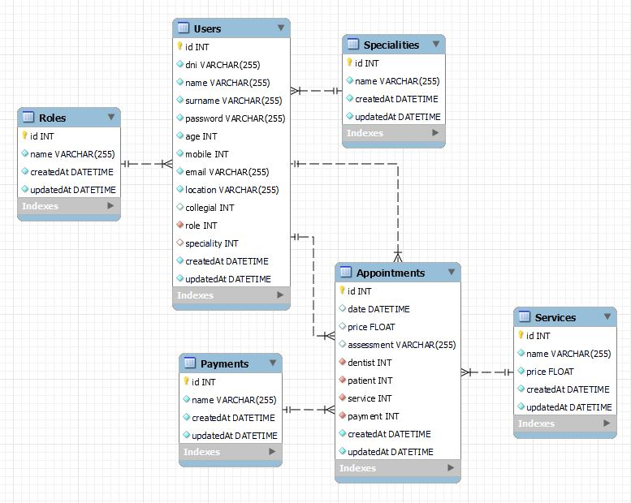

# API de una clínica dental
<details>
  <summary>Contenido 📝</summary>
  <ol>
    <li><a href="#objetivo">Objetivo</a></li>
    <li><a href="#sobre-el-proyecto">Sobre el proyecto</a></li>
    <li><a href="#diagrama-er">Diagrama Entidad Relación</a></li>
    <li><a href="#tecnologías-utilizadas">Stack - Tecnologías utilizadas</a></li>
    <li><a href="#instalación-en-local">Instalación en local</a></li>
    <li><a href="#endpoints">Endpoints</a></li>
    <li><a href="#contribuciones">Contribuciones</a></li>
    <li><a href="#agradecimientos">Agradecimientos</a></li>
    <li><a href="#contacto">Contacto</a></li>
    <li><a href="#licencia">Licencia</a></li>
  </ol>
</details>

## Objetivo
Esta API la he desarrollado con los conocimientos que he adquirido con el cuarto proyecto de GeeksHub Academy. Con el objetivo de mejorar la anterior API y disponer de un mejor Backend para el siguiente proyecto, <a href="https://github.com/hmateu/frontDentalClinic">su frontend</a>.

## Sobre el proyecto
Esta API ha sido desarrollada por **Héctor Mateu**, como mejora del cuarto proyecto del **Bootcamp de Full Stack Developer de Geekshubs Academy**, el cuál se basa en el diseño del backend de una aplicación. El cuál es totalmente funcional y se le puede atacar mediante POSTMAN.
*Como mejoras de esta API, cabe destacar la utilización de variables de entorno y una mejor practica de abstracción de funciones. Así como una organización de carpetas mucho mejor.*

## Diagrama ER


## Tecnologías utilizadas
          

## Instalación en local
1. Clona el repositorio
`$ git clone https://github.com/hmateu/dentalClinic2.0.git`
2. Instala las dependencias
`$ npm install`
3. Crea el archivo .env para las variables de entorno
4. Crea la base de datos 
`$ sequelize db:create`
5. Ejecutar las migraciones
`$ sequelize db:migrate`
6. Ejecuta los seeders
`$ sequelize db:seed:all`
7. Levanta el servicio de MySQL
**`En mi caso Docker`**
8. Levanta el servidor
`$ npm run dev`

## Endpoints
A continuación detallo los endpoints que han sido desarrollados en esta API para poder ser atacados desde un front. Desde Postman puedes verificar que funcionan correctamente. Con el propio Postman he validado cada uno de ellos.
<details>
<summary>Endpoints</summary>

- **auth**
    - **/register**

            POST http://localhost:5000/auth/register
        body:
        ``` js
            {
                "dni": "35471123Z",
                "name": "Héctor",
                "surname": "Mateu Ortolá",
                "password": "Hector1234!",
                "age": 28,
                "mobile": 630174559,
                "email": "hmateu.ortola@gmail.com",
                "location": "C/ Pintor Perales"
            }
        ```
    - **/login**

            POST http://localhost:5000/auth/login  
        body:
        ``` js
            {
                "email":"hmateu.ortola@gmail.com",
                "password":"Hector1234!"
            }
        ```
- **usuarios**
    - **/users** : Recupera todos los usuarios (debes estar logueado como admin)  

            GET http://localhost:5000/users

    - **/users/perfil** : Recupera toda la información del usuario logueado  

            GET http://localhost:5000/users/perfil

    - **/users/users** : Rescupera toda la información de los usuarios menos del admin

            GET http://localhost:5000/users/users

    - **/users/patients** : Rescupera toda la información de los pacientes

            GET http://localhost:5000/users/patients

    - **/users** : Modifica los datos del usuario logueado

            PUT http://localhost:5000/users

    - **/users/:id** : Elimina el usuario con el id que le pases por parámetro (debes estar logueado como admin)

            DELETE http://localhost:5000/users/2

- **citas**
    - **/appointments** : Recupera toda las citas (debes estar logueado como admin)  

            GET http://localhost:5000/appointments

    - **/appointments/patient** : Recupera todas las citas donde el usuario logueado es el paciente  

            GET http://localhost:5000/appointments/patient

    - **/appointments/dentist** : Recupera todas las citas donde el usuario logueado es el dentista  

            GET http://localhost:5000/appointments/dentist

    - **/appointments/:id** : Recupera la cita con el id que le pases por argumento, siempre que seas paciente de dicha cita

            GET http://localhost:5000/appointments/2

    - **/appointments** : Crea una cita para el paciente logueado

            POST http://localhost:5000/appointments

    - **/appointments/:id** : Modifica la cita con el id que le pases por argumento, siempre que seas paciente de dicha cita

            PUT http://localhost:5000/appointments/2

- **servicios**
    - **/services** : Recupera todos los servicios

            GET http://localhost:5000/services
</details>

## Contribuciones
Las sugerencias y aportaciones son siempre bienvenidas.  

Puedes hacerlo de dos maneras:

1. Abriendo una issue
2. Crea un fork del repositorio
    - Crea una nueva rama  
        ```
        $ git checkout -b feature/nombreUsuario-mejora
        ```
    - Haz un commit con tus cambios 
        ```
        $ git commit -m 'feat: mejora X cosa'
        ```
    - Haz push a la rama 
        ```
        $ git push origin feature/nombreUsuario-mejora
        ```
    - Abre una solicitud de Pull Request

## Agradecimientos
Agradezco a mis profesores el tiempo dedicado a este proyecto:

- **Dani**  
<a href="https://github.com/Datata" target="_blank"></a> 

- **David**  
<a href="https://github.com/Dave86dev" target="_blank"></a>

## Contacto
<a href = "mailto:hmateu.ortola@gmail.com"></a> <a href="https://www.linkedin.com/in/h%C3%A9ctor-mateu-ortol%C3%A1-278b92160/" target="_blank"></a> 
## Licencia
Este proyecto se ha realizado bajo la **licencia MIT**.